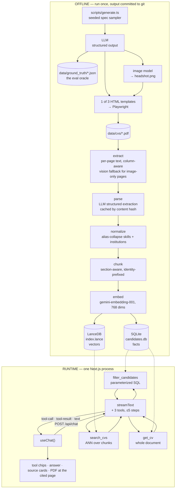

# CV Screener

Chat with a corpus of 30 synthetic CVs. Every answer is grounded in the indexed
documents and cites the PDF and page it came from.

Built as a technical task for a Full-Stack AI Engineer role. Runs locally; no
deployment, no Docker, no database server, no Python.

---

## Setup

Requires **Node ≥ 22** (`node:sqlite` is built in from 22; verified on 24.15).

```bash
npm install
cp .env.example .env      # add GOOGLE_GENERATIVE_AI_API_KEY
npm run dev               # → http://localhost:3000
```

That is the whole setup. **The built index is committed to the repo**, so there
is nothing to ingest before the app works — see [Why the index is in
git](#why-the-index-is-committed).

To rebuild the corpus and index from scratch:

```bash
npm run check                    # verify the key and see which models it can reach
npx playwright install chromium  # generation only, ~150 MB
npm run generate                 # sampler → LLM → headshots → templates → 30 PDFs
npm run ingest                   # PDFs → text → structured → chunks → SQLite + LanceDB
npm run eval                     # precision/recall, agentic vs classic
```

---

## The three questions this is built around

| Question | Shape | What it needs |
|---|---|---|
| *Who has experience with Python?* | aggregation | **all** matches, not a top-k slice |
| *Which candidate graduated from UPC?* | exact / alias | an acronym matched against a full institution name |
| *Summarize the profile of Jane Doe.* | whole document | the entire CV, not scattered chunks |

Two of the three are unanswerable by classic single-shot RAG. That is not a
tuning problem, and it drives the whole retrieval design.

---

## Architecture



**Offline** produces two files and commits them. **Runtime** is a single Next.js
process that reads them. The model chooses which retriever to call per question,
and both the tool calls and their results are streamed to the client rather than
hidden — the interface's job is to make the retrieval visible.

### Layout

```
app/                 chat UI, /api/chat, /api/candidates, /api/cv/[id], /api/photo/[id]
components/          the 7 UI components + the shadcn-style primitives they use
lib/
  llm.ts             provider wrapper — the only file that knows it's Gemini
  agent.ts           system prompt, tool loop, classic-mode baseline
  tools.ts           the 3 retrieval tools, callable without an LLM
  stores.ts          node:sqlite + LanceDB clients
  aliases.ts         institution + skill alias map
  schemas.ts         CVProfile — shared by generation, ingest and eval
  ingest/            extract · parse · normalize · chunk · index
scripts/
  generate.ts        sampler → LLM → templates → Playwright → PDF
  ingest.ts          orchestrates lib/ingest/*
  lib/sampler.ts     seeded spec sampler
  templates/         3 HTML/CSS CV templates
eval/                questions derived from ground truth + the scored comparison
data/                cvs/ · photos/ · ground_truth/ · candidates.db · index.lance
```

---

## Design decisions

### Why tool-routed RAG, not classic top-k

Classic RAG embeds the question, takes the top *k* chunks, and stuffs them into
the prompt. On this corpus that fails structurally, in two different ways:

**Recall is capped at *k*.** 18 of the 30 candidates list Python. "Who has
experience with Python?" has an 18-element answer, and top-5 retrieval can return
at most 5 of them. Raising *k* does not fix it — the correct answer is a *set*,
and any ranked prefix of a set is the wrong shape of answer. The failure is also
invisible: the model produces a confident, well-formed list that is simply
incomplete.

**Embeddings blur near-identical text.** Thirty CVs of European software
engineers are all neighbours in vector space. "UPC" and "Universitat Politècnica
de Catalunya" are not: an acronym shares almost no surface form with its
expansion, so the one candidate who actually graduated from UPC does not
reliably outrank twenty-nine others who did not.

So the model routes between three retrievers instead of always calling one:

| Tool | Backing store | For |
|---|---|---|
| `search_cvs(query, top_k)` | LanceDB ANN | fuzzy, conceptual questions |
| `filter_candidates({...})` | parameterized SQL over SQLite | aggregation, counts, exact attributes — returns **every** match plus a total |
| `get_cv(candidate_id)` | SQLite | whole-document questions: summaries, profiles |

Vector search is retained as one of three routes, not replaced. Classic RAG is
the degenerate case of this design with the other two tools removed — which is
exactly how `mode: 'classic'` is implemented, so the eval compares the same code
path minus the routing.

The measured difference is in [Evaluation](#evaluation). The toggle in the app
header runs either mode live, so the difference is visible without running the
suite.

### Why typed tool parameters, not text-to-SQL

Tool arguments are model-generated, which makes them untrusted input arriving at
a SQL boundary. Every value goes through a `?` placeholder; there is no string
interpolation into a query, and deliberately no `run_sql(query)` tool. At 30
candidates text-to-SQL buys nothing and hands the model a shell.

### Why no LangChain or LlamaIndex

The graded artifact here *is* the chunking strategy, the retriever routing, the
tool loop and the citation plumbing — and a framework hides all four behind
`create_retrieval_chain`. Mixed SQL + vector retrieval with custom citation
payloads is precisely the case where you end up subclassing framework internals
to get back the control you started with. The loop itself is about forty lines
(`lib/agent.ts`), and keeping it explicit is what makes it testable: every tool
is a plain function the eval calls with no LLM in the loop.

### Why SQLite, not Postgres

A SQLite file can be committed to git; a Postgres database cannot. That single
property is what lets a reviewer clone the repo and run two commands. `node:sqlite`
is built into Node 22+, so it costs zero dependencies, no server and no Docker.

**pgvector is the production path**, and the reason is specific: two stores means
`filter_candidates` and `search_cvs` cannot be combined into one query, so a
question like "senior Barcelona engineers who have worked on payment systems"
has to be answered by ANDing tool results rather than by a single pre-filtered
ANN scan. Postgres with pgvector unifies metadata filtering and vector search,
and at a corpus size where the vector index no longer fits comfortably in a
committed file, that is the right trade. At 30 CVs it is not.

### Why LanceDB, not Chroma or Qdrant

File-based and embedded, so it commits alongside the SQLite database and needs no
server. At 300 chunks a brute-force scan over an array would genuinely also work;
LanceDB is the version of that choice which still holds at 300,000.

### Why the index is committed

The app is not deployed, so the reviewer's local run *is* the product. Putting a
quota-limited, twenty-minute ingest between a reviewer and a working demo would
be the wrong default. `npm run ingest -- --rebuild` remains fully reproducible —
it is just not mandatory.

### Why a seeded sampler for the corpus

Asking an LLM for "30 realistic CVs" returns 30 interchangeable mid-level backend
engineers with interchangeable names — models collapse to the mode. Diversity is
enforced in code instead: `scripts/lib/sampler.ts` draws role, seniority, city,
university, employers, language and template from curated pools with a fixed
seed, and the model only writes prose inside those constraints. It also makes
generation reproducible, and it lets the corpus guarantee the properties the
evaluation depends on — exactly one UPC graduate, three two-column CVs, two
Spanish CVs, one image-only CV, and no FAANG employer anywhere, so "who worked at
Google?" has a defensible "nobody".

### Why section-aware, identity-prefixed chunks

CVs already have the boundaries a sliding window would have to guess at, so
chunking follows sections and splits work experience per role. Each chunk is
prefixed with its identity before embedding:

```
Candidate: Xavier Prieto (cv_014) — Section: Work Experience
Data Scientist, Glovo (2023-02 – Present). Own the demand-forecasting model…
```

An anonymous chunk reading "led the migration to Kubernetes" cannot be
attributed, cannot be cited, and cannot be told apart from twenty-nine
near-identical neighbours.

### Why 768-dimension embeddings

`gemini-embedding-001` is a Matryoshka model, so a truncated prefix is still a
valid embedding. 768 instead of 3072 takes the committed index from ~4 MB to
~1 MB at negligible quality cost at this scale. Document and query embeddings use
`RETRIEVAL_DOCUMENT` and `RETRIEVAL_QUERY` respectively — they are asymmetric,
and using one task type for both measurably costs recall.

---

## Two things in the corpus that make ingest non-trivial

Neither is incidental; the sampler is instructed to produce both.

**Two-column layouts.** `pdf.js` returns text items in content-stream order,
which for a sidebar template interleaves the sidebar with the main column:

```
C O N TA C T O xavier.prieto@proton.me +34 622 41 08 93 Barcelona, Spain
C O M P E T E N C I A S Python SQL scikit-learn … Xavier P…
```

`lib/ingest/extract.ts` detects the column gutter from raw text-item geometry,
splits the items, and only then clusters lines — doing it in the other order is
the bug, because a sidebar entry and a main-column entry at the same height are
not one line. It also repairs CSS letter-spacing, which `pdf.js` surfaces as
`E D U C AT I O N`.

**One CV with no text layer.** One PDF is rendered as a flattened bitmap. Pages
that extract to fewer than 50 characters are rasterised and transcribed by the
vision model instead.

---

## Evaluation

`npm run eval` scores set precision and recall over the candidate ids cited in
the answer, for both retrieval modes.

The questions are **derived from `data/ground_truth/*.json`, not hand-written**.
We generated the corpus, so we have a perfect oracle for it: the expected answer
to "who has experience with Python?" is computed by scanning the ground truth,
which means it cannot drift out of sync with what was indexed and stays correct
if the corpus is regenerated. Coverage spans all three question shapes above,
plus multi-constraint questions ("senior candidates in Barcelona who know
Python") and negative cases ("who worked at Google?", "who has experience with
COBOL?") where the correct answer is nobody and naming anyone scores zero
precision.

Both modes run the same prompt and the same code path, differing only in whether
the tools are available — otherwise the comparison would measure something other
than the retrieval strategy.

> **Numbers:** run `npm run eval` and paste its summary table here. The headline
> to look for is aggregation recall: classic top-5 cannot exceed 5/18 on the
> Python question by construction, while the agentic path returns the complete
> set.

---

## Known limitations

- **The two stores cannot be queried together.** A single pre-filtered
  vector-plus-metadata query is not expressible here; multi-constraint questions
  are answered by the model ANDing tool results across calls. pgvector is the fix,
  at the cost of a database server.
- **Extraction is tuned to templates we control.** The gutter detection and
  letter-spacing repair were written against three known layouts. Real-world CVs
  — tables, multi-page, scanned, hand-formatted — would need more than this, and
  in Python PyMuPDF would do a better job than `pdf.js` does here.
- **The parse stage trusts the LLM.** Extraction round-trips through a model, so
  a hallucinated skill would enter the index as fact. The ground-truth diff
  catches this for the synthetic corpus; a real one has no oracle.
- **No reranker.** `search_cvs` returns raw ANN neighbours. A cross-encoder
  rerank would improve the fuzzy path, and is the obvious next addition.
- **No conversation memory beyond the message array.** The API is stateless by
  design; nothing is persisted between sessions.
- **Free-tier rate limits.** A full `npm run eval` makes tens of multi-step model
  calls and can take several minutes, or hit 429s, on a free key.
- **All data is synthetic.** No real candidate information appears anywhere in
  this repository.
